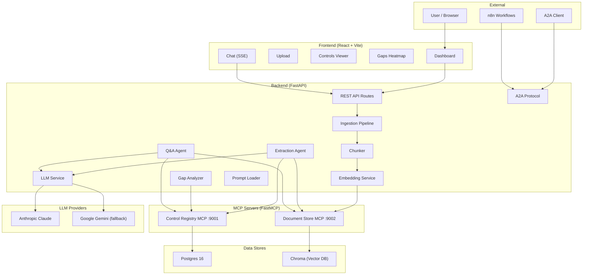

# Architecture — Regulatory Compliance Intelligence Platform

## 1. System Overview
The platform ingests regulatory documents, uses AI agents to extract compliance controls, and performs automated gap analysis against organizational controls. It includes a RAG-powered chat interface for querying the regulatory corpus.

## 2. Technology Stack
- **Backend**: FastAPI (Python 3.12, fully async)
- **Frontend**: React + Vite + TypeScript + Tailwind
- **Database**: Postgres 16 (SQLAlchemy)
- **Vector Store**: Chroma DB
- **LLMs**: Anthropic Claude (Primary), Gemini 2.5 Pro (Fallback)
- **Embeddings**: Local `all-MiniLM-L6-v2` (384-dimensional)
- **Orchestration**: n8n (for external workflows)

## 3. Protocol Usage Map
- **REST**: Primary interface for frontend-backend communication and A2A tasks.
- **MCP (Model Context Protocol)**: Used by agents to interact with the Control Registry and Document Store.
- **A2A (Agent-to-Agent)**: Standardized task submission via `/.well-known/agent.json`.
- **SSE (Server-Sent Events)**: Streams real-time chat responses to the frontend.

## 4. Component Descriptions
- **Ingestion Pipeline**: Handles PDF/TXT loading, heading-aware chunking (800 tokens), and embedding storage.
- **Gap Analyzer**: Uses cosine similarity (thresholds: 0.62 for COVERED, 0.45 for PARTIAL) to map controls.
- **Control Registry MCP**: Manages storage and search for regulatory and organization controls.
- **Document Store MCP**: Provides semantic search and chunk retrieval over Chroma.
- **LLM Service**: Handles multi-provider logic, rate limiting, and token budget enforcement.

## 5. Agent Design
The agents extend a shared `BaseAgent` class providing tool registry, MCP adaptation, and loop prevention.

### Agent Information

**Name**: Extraction Agent
**Type**: Plan-and-Execute
**Tools**: `document_store.list_chunks`, `document_store.get_chunk`, `control_registry.create_control`
**Coordination**: Plans chunk processing, extracts controls into structured JSON, and persists them to the registry.

**Name**: Q&A Agent
**Type**: ReAct (Reason + Act)
**Tools**: `document_store.search`, `control_registry.search_controls`, `control_registry.get_gap_summary`
**Coordination**: Answers user queries using RAG, providing citations and control references.

## 6. Design Patterns & Principles
1. **OOP**: Used for agent hierarchy and service modularity.
2. **SOLID**: Followed for clean separation between API, business logic, and data layers.
3. **MCP as Data Boundary**: Agents never touch the DB directly; they use tools for all data operations.

## 7. Workflow
1. **Upload**: User uploads a document; status becomes `INGESTING`.
2. **Ingestion**: Document is chunked and embedded into Chroma.
3. **Extraction**: Extraction Agent runs as a background task (Status: `EXTRACTING`).
4. **Gap Analysis**: Gap Analyzer compares extracted controls against org controls.
5. **Ready**: Processing completes; results are available for viewing and chat.

## 8. Budget Tracking & Rate Limiting
1. **Token Budgets**: Enforced per-request (200k) and per-day (2M) to control costs.
2. **Rate Limiting**: RPM enforcement per LLM provider.
3. **Fallback**: Automatic switch to Gemini on Anthropic 5xx or budget exhaustion.
